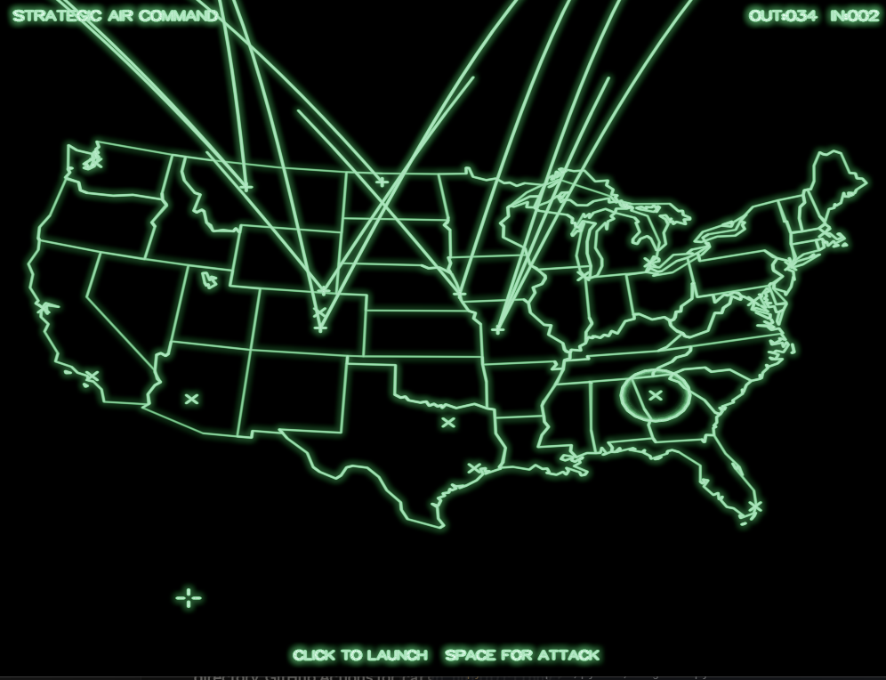
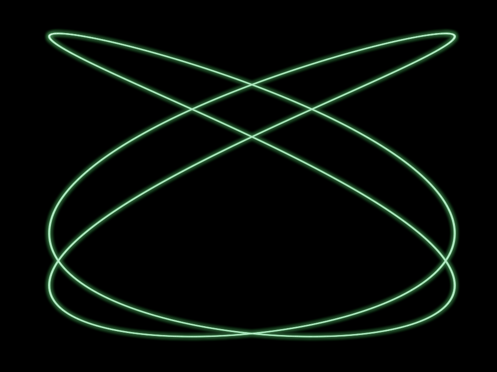
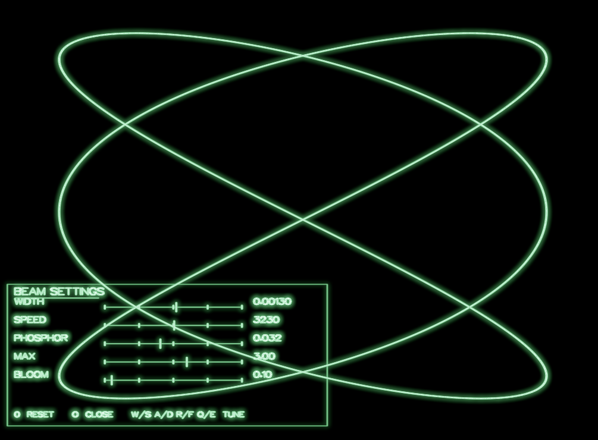
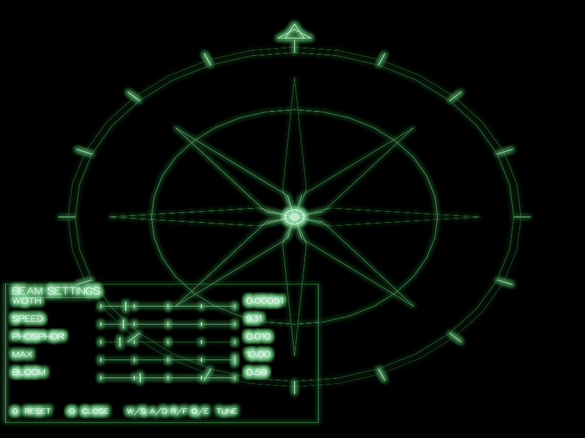
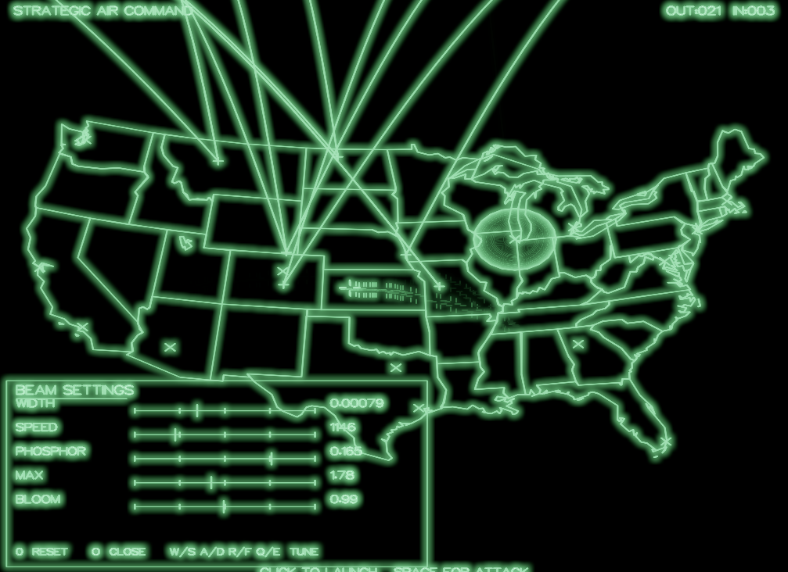
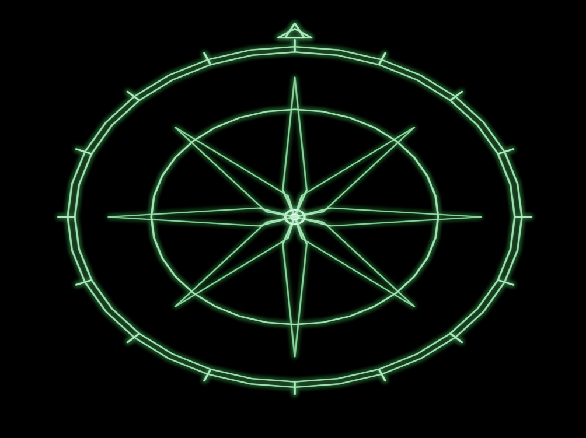

# Vector Display Simulator



A GPU-driven simulator of a classic vector CRT display in the spirit of
the HP 1345A. Written in Rust + wgpu.

The HP 1345A was a *separate device*. The host computer plugged into
the back of it and sent it beam commands over a link; the display had
no idea what was being drawn or why. This project preserves that
separation deliberately. The simulator runs as a server. Content lives
in other processes that connect to it over TCP or WebSocket and push
beam commands frame by frame — exactly the role the host computer
played in the original architecture. Content can be swapped live by
killing one client and starting another, without touching the display.
The wire protocol is small enough that any language can speak it; this
repo ships Python.

Beam commands then run through a physical model of beam scanning and
phosphor decay so the display behaves the way the original hardware
did — flicker on overload, persistence trails on moving objects,
phosphor saturation under bright overdraw, soft beam endpoints. The
look is emergent from the physics, not a post-effect. Want a thing it
draws to look more "right"? Tune the physics, don't reach for filters.

```
[your program]  ──TCP / WebSocket──►  [display server]
   (any lang)                          (Rust + wgpu)
                       events ◄──┘
                  (mouse / keys / resize, WS only)
```

When no client is connected, the display falls back to a built-in
Lissajous demo:



---

## Build and run

Requires Rust (this project uses 1.93+). On Windows, Vulkan via wgpu is
the tested backend. macOS / Linux should work via the wgpu defaults
(Metal / Vulkan).

```
cargo run --release
```

Flags:

| Flag                 | Default | Notes                                  |
|----------------------|---------|----------------------------------------|
| `--tcp-port N`       | 5001    | TCP listener port                      |
| `--ws-port N`        | 5002    | WebSocket listener port                |
| `--no-tcp-port`      | —       | Disable TCP listener                   |
| `--no-ws-port`       | —       | Disable WebSocket listener             |

`RUST_LOG=info cargo run --release` for connection logging.

---

## Drive it from Python

The simplest "hello world" — connect over WebSocket and draw a square:

```python
import asyncio, struct, websockets

async def main():
    async with websockets.connect("ws://localhost:5002") as ws:
        corners = [(-0.5, -0.5), (0.5, -0.5), (0.5, 0.5), (-0.5, 0.5)]
        while True:
            payload = struct.pack('<Bff', 0, *corners[-1])     # MoveTo
            for x, y in corners:
                payload += struct.pack('<Bfff', 1, x, y, 1.0)  # DrawTo
            await ws.send(payload)
            await asyncio.sleep(1 / 60)

asyncio.run(main())
```

More examples live in [`examples/python/`](examples/python/). The full
protocol spec — including the back-channel for mouse and key events —
is in [`docs/PROTOCOL.md`](docs/PROTOCOL.md).

---

## Keyboard controls

While the display window has focus:

| Key      | Effect                                                  |
|----------|---------------------------------------------------------|
| `w` / `s`| Beam wider / narrower (gaussian sigma)                  |
| `a` / `d`| Phosphor time constant shorter / longer                 |
| `r` / `f`| Beam slewing speed faster / slower                      |
| `q` / `e`| Bloom strength lower / higher                           |
| `o`      | Toggle on-screen settings panel                         |
| `0`      | Reset all render parameters to the shipped defaults     |
| `Esc`    | Quit                                                    |

When the settings panel is open, drag any slider with the mouse to tune
that parameter — same effect as the keyboard shortcuts, just visual.



The shipped defaults are tuned for the look in the screenshots above,
but the sliders go a long way. Same content, different physics:

<p>
  
  
</p>

`0` restores the shipped defaults at any time.

Current parameter values are also printed in the window title every
quarter second. Connected WS clients receive these key presses as
events, so you can build interactive applications.

---

## How it looks (and why)

The vector CRTs of the 70s and 80s — HP 1345A oscilloscope display, the
arcade boards behind Asteroids and Battlezone — looked alive in a way
raster displays still struggle with. That look came from real physics:
a hot beam slewed across a phosphor coating; the phosphor absorbed
photons until it saturated; it cooled back down with a time constant on
the order of ten milliseconds.

Things that just happen, no special-casing:

- **Flicker on overloaded scenes.** If you stuff too many vectors in,
  the beam can't get back to the first one before its phosphor cools.
  The flicker is real, not faked — push enough vectors at the display
  and you'll see it.
- **Persistence trails.** The phosphor doesn't immediately forget. A
  moving object leaves a soft fading streak behind it. Tune
  `phosphor_tc` to taste.
- **Brighter short segments.** Short lines are drawn slower (beam
  spends more time per unit length), so they appear brighter. Tiny dots
  are nearly point-source bright.
- **Soft endpoints.** Lines fade naturally at their ends because the
  beam profile is a 2D gaussian integrated along the segment.

All of this is in [`src/shaders/`](src/shaders/). [`CLAUDE.md`](CLAUDE.md)
goes deeper into the architecture and the GPU pipeline.

---

## Background

The spark for this project was Dave Plummer's video
[*WarGames Screens: I Bought Them! Let's get them working and drawing!*](https://www.youtube.com/watch?v=JrwvIKK3D2o),
in which he restores a pair of HP 1345A vector CRTs — the actual model
used in the filming of WarGames (1983). Watching real beam-and-phosphor
hardware come back to life made the goal here obvious: not stylize a
look, but model the physics underneath it. The default Lissajous
fallback, the WarGames demo, the P31 green tint, the intra-frame
flicker on overloaded scenes — all of it traces back to the HP 1345A
specifically.

---

## Demos

30 seconds of [`examples/python/demo_reel.py`](examples/python/demo_reel.py) —
Clifford attractor → rotating Earth → Aizawa attractor → loop. The
crossfades between segments are phosphor decay, not video editing:
previous content keeps emitting light for ~1 second as the next demo
starts drawing over it.


[`examples/python/hello.py`](examples/python/hello.py) — connect and draw a rotating square.

[`examples/python/spiral.py`](examples/python/spiral.py) — animated spiral with intensity variation.

[`examples/python/wargames.py`](examples/python/wargames.py) — the US map shown at the top of this README. States + Great Lakes from Natural Earth, Albers projection, great-circle missile arcs from real adversary launch sites. Click to fire counter-strikes, space toggles attack mode.

[`examples/python/earth.py`](examples/python/earth.py) — rotating wireframe globe. Natural Earth coastlines projected onto a unit sphere, 23.4° axial tilt, lat/lon graticule, backface culling at the limb. The continuous-motion demo of the bunch.

[`examples/python/clifford.py`](examples/python/clifford.py) — 2D Clifford attractor (`x' = sin(ay) + c·cos(ax)`, `y' = sin(bx) + d·cos(by)`). Iterates ~7500 points per frame; the phosphor persistence integrates the attractor shape over a few seconds. Parameters drift slowly so the shape morphs.

[`examples/python/aizawa.py`](examples/python/aizawa.py) — 3D Aizawa attractor. RK4 integration of a continuous chaotic system, ring buffer of recent orbit points, slow camera precession. Shape: a vortex with a ribbon wrapped around its top.

[`examples/python/svg_view.py`](examples/python/svg_view.py) — display any SVG file. Pairs well with Claude, which is very good at the stroke-only-single-color SVG subset this medium can render. See [`examples/svg/README.md`](examples/svg/README.md).



---

## File layout

```
src/
  main.rs              winit event loop, GPU init, command/event plumbing
  renderer.rs          all GPU state, pipelines, per-frame rendering
  beam.rs              command types, wire-format parser, beam-timing resolver
  demo.rs              built-in Lissajous fallback
  server/
    mod.rs             public API, event broadcast
    events.rs          DisplayEvent enum + JSON serialization
    tcp.rs             length-prefixed binary TCP listener
    ws.rs              bidirectional WebSocket listener
  shaders/
    line.wgsl          instanced quads, gaussian beam profile, intra-frame decay
    decay.wgsl         phosphor decay + capacitor-model excitation absorption
    bloom.wgsl         separable gaussian blur
    composite.wgsl     persistence + bloom → screen, P31 tint, tone map
docs/
  PROTOCOL.md          full wire-format spec, both transports
examples/
  python/              client examples
```
